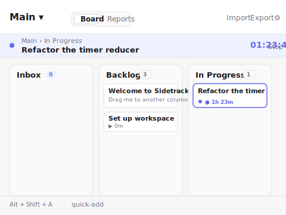
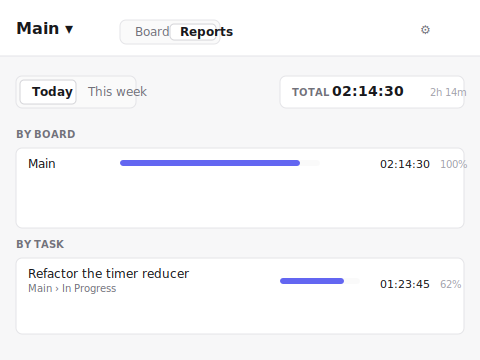
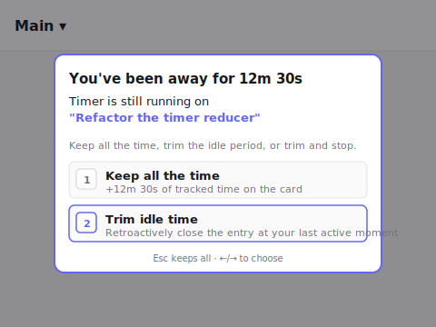

# Sidetrack

> A Chrome sidepanel that combines a kanban board with per-task
> time tracking. Offline-first, local-only, no accounts, no server.

Sidetrack lives in the Chrome sidepanel so it's always one click
away next to whatever you're working on. You get a kanban board
with a per-card timer, idle protection, and a today / this-week
report — all stored locally in your browser, with no account and
no network calls.

This project was **built autonomously by
[WieseAI OS](https://wieseai.com)** from the brief in
[`sidetrack-brief.md`](./sidetrack-brief.md). The brief is the
source of truth for what Sidetrack is; the brief's acceptance
criteria are checked off in
[`docs/reports/phase-5-self-review.md`](./docs/reports/phase-5-self-review.md).



## Install

Sidetrack is a Manifest V3 Chrome extension. It is not on the
Chrome Web Store; you install it as an unpacked extension.

1. Download the latest `dist.zip` from the
   [Releases page](https://github.com/.../releases) **or** clone
   this repo and build it yourself with `npm install && npm run
   build` (the `dist/` directory is the build output).
2. Open `chrome://extensions/` in Chrome.
3. Flip **Developer mode** on (top right).
4. Click **Load unpacked** and pick the `dist/` directory.
5. Click the Sidetrack toolbar icon to open the sidepanel. The
   first run shows a tiny onboarding panel and seeds a default
   board (Inbox / Backlog / In Progress / Done).

To rebuild after a `git pull`:

```sh
npm install
npm run build
```

Then click **Reload** on the extension card in
`chrome://extensions/`.

## Features

- **Kanban in the sidepanel.** Boards, columns, cards; create,
  rename, reorder, delete. Drag and drop between and within
  columns. Default board on first launch.
- **Quick-add.** Type a title and hit Enter. The new card lands
  in the column you were looking at. Keyboard-friendly
  (`Alt+Shift+A` focuses the input).
- **Per-card timer.** One click to start, one click to stop. The
  running timer is always visible at the top of the sidepanel.
  Starting a timer on another card automatically stops the
  previous one and tells you it did.
- **Idle protection.** Sidetrack detects when you've been away
  from the keyboard and prompts you to keep, trim, or stop the
  running timer. The threshold is configurable in Settings.
- **Right-click capture.** Right-click on any web page → "Add to
  Sidetrack" → the page title and URL land in your Inbox column.
  Select text first to capture the selection.
- **Time reports.** The Reports tab shows "Today" and "This
  week" with a per-task and per-board breakdown.
- **Themes.** Light, dark, or follow the system preference.
  Settings → Theme.
- **Keyboard-first.** Global chords (open the sidepanel, quick-add,
  toggle timer on the focused card) plus in-sidepanel shortcuts.
  Press `?` in the sidepanel to see the full list.
- **Undo.** Deleting a board, a card, or a time entry surfaces a
  toast with an Undo button (5–6 seconds to act).
- **Accessible.** Polite live-region announcements on timer
  start/stop and on drag start/end. Keyboard navigation
  throughout. Honors `prefers-reduced-motion`.
- **Local-only.** All data lives in `chrome.storage.local`. No
  network calls. Export to JSON, wipe the extension, import
  — everything is back.
- **Keyboard-only workflow.** Open the sidepanel, add cards,
  move them, start/stop the timer, navigate the report — all
  without a mouse.

## Screenshots

| Sidepanel (board view) | Sidepanel (Reports tab) | Idle prompt |
| --- | --- | --- |
|  |  |  |

The screenshots above are SVGs of the sidepanel layout rendered
from real CSS (no images baked in). The actual extension
renders the same view in your browser.

## Keyboard shortcuts

| Chord | Action |
| --- | --- |
| `Alt+Shift+S` | Open the Sidetrack sidepanel (global) |
| `Alt+Shift+A` | Quick-add a card in the focused column (global) |
| `Alt+Shift+T` | Toggle the timer on the focused card (global) |
| `?` | Open the in-sidepanel shortcuts help |
| `Esc` | Close the topmost dialog or overlay |
| `1` / `2` / `3` | Idle prompt: Keep / Trim / Stop |
| `←` / `→` | Idle prompt: move between choices |

Global chords are rebindable from
`chrome://extensions/shortcuts`.

## Privacy

Sidetrack does not make any network calls. It does not collect
any telemetry. All data lives in `chrome.storage.local` on your
machine. You can export the entire state to JSON from the
header, and you can wipe it by uninstalling the extension.

## Architecture

- **TypeScript + Preact + Vite.** No CSS framework, hand-rolled
  CSS with variables for theming.
- **Manifest V3 service worker** owns the timer-reconciliation
  alarm, idle detection, and the right-click capture context
  menu.
- **`chrome.storage.local`** is the single source of truth; the
  reducer in `src/shared/reducer.ts` is the only writer.
- **Schema-versioned** persisted state (`SCHEMA_VERSION = 5`).
  Export / import round-trips the whole workspace.

The full architectural decisions live in
[`docs/gsd/01-decisions.md`](./docs/gsd/01-decisions.md) and the
phase reports under [`docs/reports/`](./docs/reports/).

## Project structure

```
src/
  shared/         pure data layer (model, reducer, timer, reports)
  background/     MV3 service worker (alarms, capture, idle)
  sidepanel/      the Preact UI (App, components, styles)
  assets/icons/   extension icons
tests/            vitest unit / integration tests
docs/
  gsd/            the GSD plan and decision log
  issues/         the issue backlog (one Markdown file per issue)
  reports/        one report per phase, plus a self-review
```

## Development

```sh
npm install
npm test       # 230+ tests, runs in ~7s
npm run dev    # vite dev server (open the sidepanel from the
               # toolbar once the dev server is running)
npm run build  # tsc --noEmit && vite build → dist/
```

## Built by WieseAI OS

This project was built autonomously by
[WieseAI OS](https://wieseai.com) from the brief in
[`sidetrack-brief.md`](./sidetrack-brief.md). The GSD plan,
the architectural decisions, and the per-phase reports are
the human-readable record of what was researched, what was
decided, and what was shipped.

## License

[MIT](./LICENSE)
